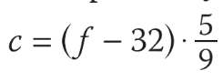

# 315-Python

### Zadania do opracowania do sprawdzianu

1.Przygotuj program przeliczajacy temperaturę ze skali Fahrenheita na Celsjusza (zapytaj o temperaturę). wg wzoru 

2. Przygotuj program sprawdzający warunek trójkąta po podaniu długości boków a, b, c

3. Przygotuj program przeliczający PLN na Euro i Euro na PLN przy kursie 4.22. (zapytaj o walutę i o kwotę)

4. 
