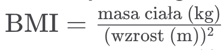

# 315-Python

### Zadania do opracowania do sprawdzianu

1.Przygotuj program przeliczajacy temperaturę ze skali Fahrenheita na Celsjusza (zapytaj o temperaturę). wg wzoru 

2. Przygotuj program sprawdzający warunek trójkąta po podaniu długości boków a, b, c

3. Przygotuj program przeliczający PLN na Euro i Euro na PLN przy kursie 4.22. (zapytaj o walutę i o kwotę)

4. Napisz program, który dla podanego wzrostu (w centymetrach) i wagi (w kilogramach) obliczy wskaźnik masy ciała (BMI).
Uwaga: Przyjmij, że użytkownik wprowadza liczby całkowite, wg wzoru 

5. Napisz program, który po wczytaniu liczby trzycyfrowej wyświetli jej cyfry w odwróconym porządku.

6. Napisz program, który dla liczb a, b, c i d obliczy i wyświetli sumę wartości bezwzględnych różnic |a-b|+|b-a|+|c-d| Program powinien się posługiwać wyłącznie instrukcja-
mi if oraz dodawaniem i odejmowaniem.
